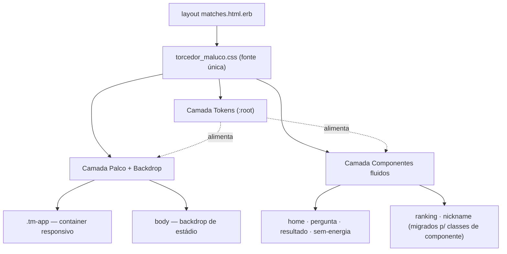

# Design Responsivo Multi-Tela — Design

**Spec:** `.specs/features/design-responsivo/spec.md`
**Status:** Approved
**Decisão de base (usuário, 2026-06-14):** CSS de componentes + tokens como fonte única; **não** reescrever as telas do jogo em utilitários Tailwind.

---

## Architecture Overview

A abordagem é **CSS de componentes orientado a tokens**, sem reescrever a estrutura do jogo. Em vez de um shell de largura fixa flutuando no vazio, introduzimos três camadas no stylesheet canônico (`torcedor_maluco.css`):

1. **Tokens** (`:root`) — fonte única de cores, larguras do palco, escala de tipo fluida e espaçamento. Ajustar responsividade = mexer aqui.
2. **Palco + Backdrop** — o `.tm-app` vira um container responsivo (cresce de forma controlada, com `container-type:inline-size`) sobre um **fundo de estádio** branded (CSS puro) que só aparece quando há espaço (telas grandes).
3. **Componentes fluidos** — logo, pergunta, placar, cronômetro, botões e alternativas consomem os tokens de tipo (`clamp()`/`cqi`) para escalar proporcionalmente ao palco.

> Diagrama inline (mermaid). A skill `mermaid-studio` não está instalada — para renderização SVG/validação, vale instalá-la (aviso único nesta sessão).

---

## Discovered State (pré-condição importante)

Levantamento do código atual que o design precisa endereçar:

| Fato | Implicação |
|------|-----------|
| `matches`, `ranking`, `nicknames`, `answers` usam `layout "matches"`, que carrega **só** `torcedor_maluco.css` | Tailwind **não** está disponível nessas páginas em runtime |
| `ranking/index.html.erb` e `nickname/new.html.erb` usam utilitários Tailwind (`bg-amarelo/20`, `rounded-2xl`, `flex`, `font-fredoka`…) | Essas classes estão **mortas hoje** → as duas telas renderizam degradadas (sem o estilo pretendido). Migrar para classes de componente resolve E corrige o bug existente |
| `.tm-app`, `.hdr`, `.ball` etc. só existem em `torcedor_maluco.css` | Confirma que o stylesheet do jogo é o canônico para o app ativo |
| `application.css` duplica `.btn-play`/`.opt`/`.logo-sticker`/`.header-ball` e só é carregado por `layout application` (legado `games/*`) | A duplicação real está entre as duas folhas; o app **ativo** já não carrega `application.css`. Congelar `application.css` ao legado satisfaz RESP-11 para o app ativo |
| `.tm-app{ overflow:hidden }` | Bloqueia rolagem — problema em paisagem/altura baixa (RESP-09). Trocar para rolagem quando o conteúdo excede a altura |
| Confete: `translateY(880px)` fixo no keyframe | Não cobre alturas grandes (RESP-14). Trocar por unidade de viewport |
| `:root` em `torcedor_maluco.css` já define a paleta como CSS vars; `@theme` (tailwind) define a mesma paleta | Os tokens de cor já existem como CSS vars — usamos `:root` como fonte de token do app ativo |

---

## Code Reuse Analysis

### Existing Components to Leverage

| Component | Location | How to Use |
|-----------|----------|------------|
| Stylesheet canônico do jogo | `app/assets/stylesheets/torcedor_maluco.css` | **Base única**: adicionar camada de tokens, tornar `.tm-app` responsivo, fluidificar componentes |
| `:root` (paleta CSS vars) | `torcedor_maluco.css:9` | Estender com tokens de palco/tipo/espaçamento — fonte única de tokens do app ativo |
| Padrão `.field` (listras + círculo central) | `torcedor_maluco.css:63` | Reaproveitar a linguagem visual para compor o **backdrop de estádio** (escala maior, no `body`) |
| Layout `matches.html.erb` | `app/views/layouts/matches.html.erb` | Continua sendo o layout único das páginas ativas; nenhum novo CSS a carregar |
| Header `matches/_header` (`.hdr`) | `app/views/matches/_header.html.erb` | Mantido; passa a escalar via tokens |
| Telas do jogo (home/pergunta/resultado/sem-energia) | `app/views/matches/*` | **Markup praticamente intacto** — só ajustes pontuais de wrapper/rolagem; o ganho vem do CSS |
| `@theme` (tokens Tailwind) | `app/assets/tailwind/application.css` | Permanece para o legado `games/*`; espelha a paleta (caveat documentado) |

### Integration Points

| System | Integration Method |
|--------|--------------------|
| Asset pipeline (propshaft/sprockets) | `stylesheet_link_tag "torcedor_maluco"` já está no layout; sem novos links |
| Turbo Frames (`#match`) | Header e palco ficam **fora** do frame; layout responsivo não muda o contrato Turbo |
| `allow_browser versions: :modern` (ApplicationController) | **Habilita** uso de container queries (`cqi`), `clamp()`, `dvh`, `:has` — navegadores garantidamente modernos |

> Nota de débito (STATE.md): `application.css` e as views `games/*` são legado. Não os refatoramos aqui (fora de escopo); registramos como deferred "retirar `games/*` + `application.css`".

---

## Components

### 1. Camada de Tokens (`:root`)

- **Purpose:** Fonte única das variáveis que controlam a responsividade — mudar palco/escala = editar aqui (RESP-12).
- **Location:** topo de `app/assets/stylesheets/torcedor_maluco.css`
- **Interfaces (tokens):**
  - `--stage-max` — teto de largura do palco; **bumped por breakpoint** (430 → 480 → 560)
  - `--fs-logo`, `--fs-qtext`, `--fs-score`, `--fs-btn`, `--fs-opt` — `clamp(min, Ncqi, max)` (escala relativa ao palco via container query units)
  - `--ring-size` — `clamp()` para o cronômetro
  - `--pad-screen` — espaçamento de tela fluido
- **Dependencies:** nenhuma (CSS vars).
- **Reuses:** o `:root` já existente (só estende).

### 2. Palco responsivo (`.tm-app`)

- **Purpose:** Coluna central que cresce de forma controlada e habilita escala relativa ao palco (RESP-01, RESP-04).
- **Location:** `torcedor_maluco.css` (`.tm-app`)
- **Mudanças:**
  - `max-width: var(--stage-max)` (no lugar de `430px` fixo) + `width:100%`
  - `container-type: inline-size` → habilita unidades `cqi` nos componentes (escala proporcional ao palco, não ao viewport)
  - `overflow: hidden` → **removido/relaxado** para permitir rolagem quando o conteúdo excede a altura (RESP-09)
  - `min-height:100dvh` e `margin-inline:auto` mantidos
  - Breakpoints (poucos, centralizados): `@media (min-width:700px){--stage-max:480px}` · `@media (min-width:1024px){--stage-max:560px}`
- **Mobile baseline:** em ≤640px, `--stage-max` permanece 430px → **layout idêntico ao atual** (RESP-03).
- **Reuses:** estrutura flex-column existente.

### 3. Backdrop de estádio (`body`)

- **Purpose:** Substituir o vazio `#0c0d12` por um ambiente branded que só aparece em telas grandes (RESP-02, RESP-13).
- **Location:** `torcedor_maluco.css` (`html,body` + pseudo-elementos)
- **Composição (CSS puro, sem imagem):** gradiente de gramado (verdes da paleta) + listras de campo (reaproveita o padrão `.field::before`) + vinheta/escurecimento nas bordas para destacar o palco; detalhe extra (profundidade) em `@media (min-width:1440px)`.
- **Garantias:** `pointer-events:none`, estático (sem animação → trivialmente compatível com `prefers-reduced-motion`); em mobile o palco preenche a viewport e o backdrop fica naturalmente oculto.
- **Reuses:** linguagem visual de `.field`.

### 4. Componentes fluidos

- **Purpose:** Logo, pergunta, placar, cronômetro, botões e alternativas escalam com o palco (RESP-05, RESP-06).
- **Location:** regras existentes em `torcedor_maluco.css` (`.logo .l1/.l2`, `.qtext`, `.res-score`, `.ring`, `.btn-play`, `.opt`)
- **Mudança:** trocar `font-size`/dimensões fixas pelos tokens de `clamp()`/`cqi`; manter mínimos legíveis (~320px) e tetos para não estourar cards.
- **Toque:** `.opt` mantém `min-height` ≥ 48px (já 58px) em qualquer largura.
- **Reuses:** todas as classes e estados (`.chosen/.correct/.wrong/.dim`) permanecem — só o dimensionamento muda.

### 5. Confete responsivo

- **Purpose:** Cobrir a altura visível em qualquer tela (RESP-14).
- **Location:** keyframe `@keyframes fall` em `torcedor_maluco.css`
- **Mudança:** `translateY(880px)` → `translateY(105dvh)` (ou `100vh`); mantém `prefers-reduced-motion` já existente.

### 6. Componente de Ranking (`.rank-*`)

- **Purpose:** Migrar `ranking/index` de utilitários Tailwind (hoje mortos) para classes de componente responsivas (RESP-07).
- **Location:** novas regras em `torcedor_maluco.css`; `app/views/ranking/index.html.erb` reescrito com as classes
- **Classes:** `.rank-wrap` (área rolável dentro do palco), `.rank-cta` (faixa de login p/ convidado), `.rank-row` (+ `.is-me`), `.rank-medal`, `.rank-name`, `.rank-score`, estado vazio.
- **Responsivo:** largura de leitura confortável alinhada ao palco; rolagem interna correta em telas altas (RESP-07 #2).
- **Reuses:** `.hdr` (header), tokens, paleta.

### 7. Componente de Formulário/Nickname (`.form-*`)

- **Purpose:** Migrar `nickname/new` para classes de componente centralizadas (RESP-08).
- **Location:** novas regras em `torcedor_maluco.css`; `app/views/nicknames/new.html.erb` reescrito
- **Classes:** `.form-card` (cartão centralizado, largura máxima legível), `.form-title`, `.form-hint`, `.form-error`, reaproveita `.nick` (input) e `.btn`.
- **Reuses:** `.nick`, `.btn`, `.home-card` como referência visual.

### 8. Consolidação / fonte única

- **Purpose:** Garantir definição única dos estilos do app ativo (RESP-11).
- **Ação:** `torcedor_maluco.css` torna-se a fonte única das páginas ativas (já é o único CSS carregado por `layout matches`). `application.css` fica **congelado e rotulado** como exclusivo do legado `games/*`. Nenhuma página ativa carrega regra duplicada.
- **Não fazemos:** refatorar/migrar `games/*` (fora de escopo) — fica como deferred.

---

## Data Models

Não se aplica — feature puramente de apresentação (CSS + ajustes de markup ERB). Sem migrations, sem mudança de modelo ou de contrato de controller.

---

## Responsive Token Reference (rascunho de valores)

> Valores iniciais para calibrar na implementação (medir o computed em 320/430/560).

| Token | Valor proposto | Racional |
|-------|----------------|----------|
| `--stage-max` (base / ≥700 / ≥1024) | `430px` / `480px` / `560px` | Preserva mobile; cresce controlado; teto que mantém foco |
| `--fs-logo` | `clamp(40px, 12cqi, 60px)` | ~46px no palco mobile (atual), teto 60 no palco grande |
| `--fs-qtext` | `clamp(20px, 6.2cqi, 27px)` | atual 23px no meio da faixa |
| `--fs-score` (resultado) | `clamp(64px, 22cqi, 104px)` | atual 84px; teto sem estourar o card |
| `--fs-btn` | `clamp(18px, 5.4cqi, 23px)` | atual 21px |
| `--ring-size` | `clamp(72px, 20cqi, 96px)` | atual 78px |

> `cqi` = 1% da largura do container (`.tm-app` com `container-type:inline-size`), garantindo escala **relativa ao palco** e não ao viewport inteiro (evita logo gigante em monitor ultra-wide). Suportado pelos navegadores modernos exigidos por `allow_browser :modern`.

---

## Error Handling / Graceful Degradation

| Cenário | Tratamento | Impacto |
|---------|-----------|---------|
| Navegador sem container queries | `allow_browser :modern` já bloqueia navegadores antigos; ainda assim, `clamp()` com fallback de viewport mantém legibilidade | Nenhum prático |
| Conteúdo maior que a altura (paisagem/zoom 200%) | Palco permite rolagem (remoção do `overflow:hidden`) + `@media (max-height:480px)` reduz paddings | Rolagem aceitável, nada cortado (RESP-09, RESP-15) |
| Viewport ultra-wide | `max-width: var(--stage-max)` + `margin-inline:auto` centralizam; backdrop preenche o resto | Palco centralizado, sem distorção |
| Backdrop não suportado (gradiente) | Fallback para cor sólida da paleta | Degradação visual mínima |
| Teclado virtual na home | Palco rolável + input dentro do `.home-card` | Botão "Jogar" alcançável (RESP-09 #3) |

---

## Tech Decisions (only non-obvious ones)

| Decisão | Escolha | Racional |
|---------|---------|----------|
| Base de estilo | Componentes + tokens em `torcedor_maluco.css` (não reescrever em Tailwind) | Decisão do usuário; menor risco; preserva pixel-perfect mobile; o jogo já é todo classes semânticas |
| Escala de tipo | `clamp()` com **`cqi`** (container query units), palco com `container-type:inline-size` | Escala relativa ao **palco**, não ao viewport — evita tipografia gigante em ultra-wide; correto e enxuto |
| Crescimento do palco | `--stage-max` em **degraus por breakpoint** (430/480/560) | Mantém o mobile literalmente idêntico (RESP-03) e dá controle explícito; mais previsível que um clamp contínuo de largura |
| Backdrop | CSS puro reaproveitando `.field` (sem imagem) | Zero peso de asset, on-brand, fácil de tunar; some sozinho no mobile |
| Fonte única de token | `:root` do stylesheet do app ativo | É o único CSS carregado nas páginas ativas; `@theme` permanece só para o legado (caveat) |
| Ranking/nickname | Migrar para **classes de componente** (não habilitar Tailwind no layout) | Corrige o bug das classes Tailwind mortas e mantém um único paradigma no app ativo |
| `application.css` / `games/*` | Congelar como legado, não refatorar | Fora de escopo; evita risco; deferred para quando `games/*` for retirado |
| Verificação | Matriz visual em breakpoints (320/390/768/1024/1440/1920) + suíte verde | Feature é de apresentação; sem lógica nova para teste unitário (ver TESTING.md: views estáticas = none) |

---

## Verification Strategy

Conforme `.specs/codebase/TESTING.md` (views/partials estáticas → **none**; telas no navegador → **system**):

- **Sem novos testes unitários** (não há lógica nova).
- **Não-regressão funcional:** `bin/rails test` permanece verde (nenhuma mudança de controller/model).
- **Verificação visual (manual/preview):** matriz de larguras **320 / 390 / 768 / 1024 / 1440 / 1920** em cada superfície (home, pergunta, resultado, sem-energia, ranking, nickname), checando: sem rolagem horizontal, mobile sem regressão, backdrop nas telas grandes, tipografia escalando, paisagem 740×360 jogável.
- **(Opcional)** 1 system smoke test garantindo que as superfícies renderizam sem erro em largura desktop (sobe servidor/navegador) — avaliar custo/benefício na fase Tasks.

---

## Resolved Questions (2026-06-14)

1. **Base:** CSS de componentes + tokens (não reescrever em Tailwind).
2. **Ambição desktop:** palco central escalado + backdrop (não multi-coluna).
3. **`games/*` + `application.css`:** fora de escopo (legado) — deferred.

**Status:** Approved.
