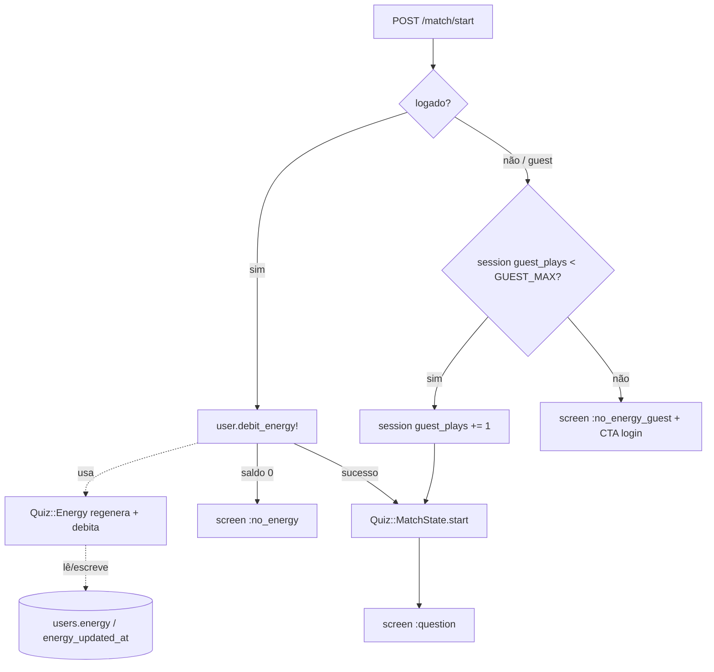

# Mecânica de Energia — Design

**Spec:** `.specs/features/energia/spec.md`
**Context:** `.specs/features/energia/context.md`
**Status:** Approved

---

## Architecture Overview

A regra de energia vive num **PORO calculador** (`Quiz::Energy`), seguindo o mesmo padrão de `Quiz::MatchState`/`Quiz::Question` (namespace `Quiz::`, configuração por constantes no topo). O `User` ganha duas colunas (`energy`, `energy_updated_at`) e métodos finos que **delegam** o cálculo ao `Quiz::Energy`. Nenhum job de background: a energia é **computada sob demanda** a partir do par `(energy, energy_updated_at)` e do relógio.

O `MatchesController#start` passa a ser o **portão** (gate): debita energia de logado (atômico, com lock de linha) ou conta jogada de convidado na sessão. Sem energia → renderiza o estado de tela `:no_energy`.



---

## Code Reuse Analysis

### Existing Components to Leverage

| Component | Location | How to Use |
|-----------|----------|------------|
| Padrão PORO `Quiz::` + constantes de config | `app/models/quiz/match_state.rb` | Replicar estilo em `Quiz::Energy` (config no topo, métodos puros) |
| `User` model | `app/models/user.rb` | Adicionar colunas + métodos `current_energy`, `debit_energy!`, `next_recharge_at`, `unlimited_energy?` |
| `MatchesController#start` | `app/controllers/matches_controller.rb:16` | Inserir o gate de energia antes de `MatchState.start` |
| Estados de `@screen` + `render :show` | `matches_controller.rb` + `app/views/matches/` | Adicionar estados `:no_energy` / `:no_energy_guest` ao switch de telas |
| Header do quiz | `app/views/layouts/matches.html.erb` | Inserir indicador `⚡ x/5` para logados |
| CSS hi-fi | `app/assets/stylesheets/torcedor_maluco.css` | Estilizar indicador e tela "sem energia" no mesmo idioma visual |

### Integration Points

| System | Integration Method |
|--------|--------------------|
| `users` (PostgreSQL) | Migration adiciona `energy:integer` (default 5, null:false) e `energy_updated_at:datetime` |
| Sessão (convidado) | `session[:guest_plays]` (inteiro), incrementado no `start`; sem persistência no BD |
| `MatchesController` | `before_action`/método privado de gate antes de iniciar a partida |

> Nota de débito técnico (STATE.md): existe duplicação de `@is_guest` em `#show`/`#next_question`. Ao tocar o controller, extrair `before_action :set_guest_flag` resolve isso de passagem.

---

## Components

### `Quiz::Energy`

- **Purpose**: Centraliza TODA a regra de energia — config e cálculo de regeneração — para que mudar o intervalo/teto seja alteração de uma linha (ENERGY-08).
- **Location**: `app/models/quiz/energy.rb`
- **Config (ponto único)**:
  - `MAX = 5`
  - `RECHARGE_INTERVAL = 2.hours`  ← muda aqui para recalibrar
  - `GUEST_MAX = 3`
- **Interfaces** (PORO puro, sem AR — recebe valores, devolve valores; testável em isolamento):
  - `Quiz::Energy.current(stored:, updated_at:, now: Time.current) -> Integer` — energia regenerada virtual (ENERGY-06, ENERGY-07)
  - `Quiz::Energy.settle(stored:, updated_at:, now:) -> [Integer, Time]` — devolve `[energy, updated_at]` "acertados" (aplica regen, avança o relógio preservando o resto)
  - `Quiz::Energy.next_recharge_at(stored:, updated_at:, now:) -> Time | nil` — `nil` se cheia (ENERGY-12)
- **Dependencies**: nenhuma (apenas `Time`).
- **Reuses**: padrão de `Quiz::MatchState`.

### `User` (extensão)

- **Purpose**: Expor a energia do usuário e o débito atômico, delegando o cálculo ao `Quiz::Energy`.
- **Location**: `app/models/user.rb`
- **Interfaces**:
  - `current_energy(now = Time.current) -> Integer` — leitura virtual (não persiste) via `Quiz::Energy.current`
  - `next_recharge_at(now = Time.current) -> Time | nil`
  - `unlimited_energy? -> false` — gancho do M3 (assinante); default `false` (ENERGY-03)
  - `debit_energy! -> Boolean` — **atômico**: `with_lock` → settle → checa `>= 1` → `-1` → salva. Retorna `false` se sem saldo (ENERGY-01, ENERGY-02, edge duplo-clique)
- **Dependencies**: colunas `energy`, `energy_updated_at`; `Quiz::Energy`.
- **Reuses**: AR `with_lock` (SELECT … FOR UPDATE no Postgres) para atomicidade.

### `MatchesController` (gate)

- **Purpose**: Aplicar a regra antes de iniciar a partida; escolher a tela certa quando bloqueado.
- **Location**: `app/controllers/matches_controller.rb`
- **Lógica em `#start`**:
  - logado: `unless current_user.unlimited_energy? || current_user.debit_energy!` → `@screen = :no_energy; return render :show`
  - convidado: `if session[:guest_plays].to_i >= Quiz::Energy::GUEST_MAX` → `@screen = :no_energy_guest; return render :show`; senão `session[:guest_plays] = session[:guest_plays].to_i + 1`
  - sucesso → fluxo atual (`MatchState.start`)
- **Dependencies**: `User#debit_energy!`, `Quiz::Energy::GUEST_MAX`, sessão.
- **Reuses**: estrutura de `@screen`/`render :show` existente.

### Views (UI)

- **Indicador de energia** — `app/views/layouts/matches.html.erb` (ou parcial `matches/_energy.html.erb`): `⚡ current_energy/5` + "próxima em ~Xh" para logados; "∞" se `unlimited_energy?`. (ENERGY-11, ENERGY-12)
- **Tela "Sem energia"** — parcial `matches/_no_energy.html.erb`: contagem até `next_recharge_at` + placeholder "Em breve: jogadas ilimitadas para assinantes" + botão **"Ver ranking"** (`ranking_path`) para manter o usuário no app. (ENERGY-05)
- **Tela "Sem energia (convidado)"** — parcial `matches/_no_energy_guest.html.erb`: "Faça login com Google para jogar mais" + botão OAuth. (ENERGY-10)

---

## Data Models

### `users` (colunas adicionadas)

```ruby
# db/migrate/XXXXXX_add_energy_to_users.rb
add_column :users, :energy,            :integer,  null: false, default: Quiz::Energy::MAX  # = 5
add_column :users, :energy_updated_at, :datetime, null: true
```

| Coluna | Tipo | Semântica |
|--------|------|-----------|
| `energy` | integer (default 5) | Energia **persistida** na última escrita (não é necessariamente a atual — somar a regeneração) |
| `energy_updated_at` | datetime (nullable) | Quando `energy` foi acertada pela última vez. `nil` ⇒ tratada como cheia (usuários pré-feature) |

**Relationships**: nenhuma nova; estende `User`.

### Algoritmo de regeneração (`Quiz::Energy.settle`)

```
elapsed = now - updated_at            # updated_at nil ⇒ retorna [stored, now] (trata como cheia)
return [stored, updated_at] if stored >= MAX        # cheia: nada a regenerar
regen = (elapsed / RECHARGE_INTERVAL).floor
return [stored, updated_at] if regen <= 0
new_energy = min(MAX, stored + regen)
new_ts     = new_energy >= MAX ? now : updated_at + regen * RECHARGE_INTERVAL  # preserva o "resto"
[new_energy, new_ts]
```

`debit_energy!` (no `User`, dentro de `with_lock`):
```
e, ts = Quiz::Energy.settle(stored: energy, updated_at: energy_updated_at, now:)
return false if e < 1
ts = now if e >= MAX           # debitando a partir do cheio, o relógio começa agora
update!(energy: e - 1, energy_updated_at: ts)
true
```

---

## Error Handling Strategy

| Error Scenario | Handling | User Impact |
|----------------|----------|-------------|
| Logado sem energia tenta jogar | `debit_energy!` retorna `false` → `@screen = :no_energy` | Vê tela com contagem até a recarga + gancho de assinatura |
| Convidado no limite | Contador de sessão ≥ `GUEST_MAX` → `@screen = :no_energy_guest` | Vê CTA de login com Google |
| Duplo-clique no "Jogar" | `with_lock` serializa; segundo débito vê saldo já reduzido | No máximo 1 energia debitada por partida; sem saldo negativo |
| `energy_updated_at` nulo (usuário pré-feature) | `settle`/`current` tratam `nil` como cheia | Começa com 5; nada quebra |
| Ausência longa (dias) | `min(MAX, …)` limita ao teto | Energia volta a 5, nunca mais |

---

## Tech Decisions (only non-obvious ones)

| Decision | Choice | Rationale |
|----------|--------|-----------|
| Onde mora a regra | PORO `Quiz::Energy` (não métodos espalhados no `User`) | Config num lugar só (ENERGY-08); testável sem BD; espelha `Quiz::MatchState` |
| Regeneração | Computada sob demanda de `(energy, energy_updated_at)` | Sem job/cron; simples; leitura sempre correta (ENERGY-07) |
| Atomicidade do débito | `with_lock` (SELECT FOR UPDATE no Postgres de prod) | Evita saldo negativo em duplo-clique sem otimismo frágil |
| Convidado | Contador em `session[:guest_plays]`, sem BD | Zero-fricção mantida; driblar limpando cookies é aceito no MVP |
| Estado "sem energia" | Novo valor de `@screen` (`:no_energy`/`:no_energy_guest`) | Reusa o switch de telas já existente em `render :show` |
| Assinante ilimitado | Só o gancho `unlimited_energy? => false` agora | Implementação real fica para o M3 (assinatura) |

---

## Resolved Questions (2026-06-14)

1. **`GUEST_MAX = 3`** — convidado joga 3x antes do bloqueio com CTA de login.
2. Indicador de energia (`⚡ x/5`) aparece no **header + home**.
3. Tela "sem energia" do logado **tem botão "Ver ranking"** enquanto espera (retenção).

**Status:** Approved.
