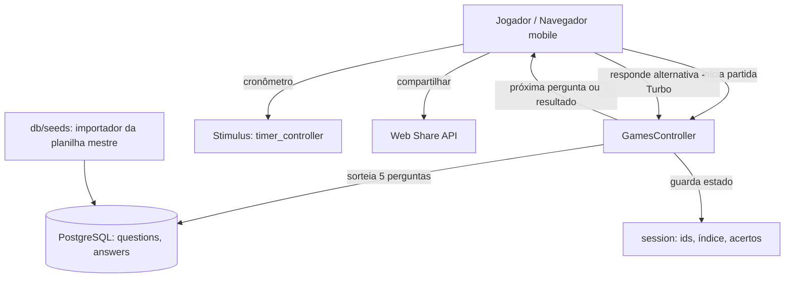

# Quiz MVP — Design

**Spec**: `.specs/features/quiz-mvp/spec.md`
**Status**: Draft

---

## Architecture Overview

App Rails monolítico, server-rendered, com Hotwire para a interatividade da partida. O servidor mantém o estado da partida na sessão; cada resposta dispara uma requisição Turbo que devolve a próxima pergunta (ou a tela final) como um fragmento de HTML, trocado sem recarregar a página. O cronômetro roda no cliente via um controller Stimulus.



---

## Code Reuse Analysis

Projeto greenfield — pouco a reusar internamente; a "reutilização" aqui é apoiar-se nas convenções e geradores do próprio Rails.

| Recurso | Como usar |
| --- | --- |
| Geradores do Rails (`rails g model/controller`) | Criar models e controller seguindo o padrão MVC |
| Hotwire/Turbo (nativo no Rails 7) | Trocar a pergunta atual via `turbo_frame` / Turbo Stream |
| Stimulus (nativo) | Controller de cronômetro no cliente |
| `roo` gem (ou CSV export da planilha) | Ler o `.xlsx` mestre no seed |

### Integration Points

| Sistema | Método de integração |
| --- | --- |
| Planilha mestre `banco-perguntas-torcedor-maluco.xlsx` | Lida no `db/seeds.rb` (via gem `roo`) e convertida em registros de Question/Answer |
| Web Share API (navegador) | Compartilhamento nativo no mobile, acionado por Stimulus, com fallback de copiar link |

---

## Components

### GamesController

- **Purpose**: Orquestrar uma partida — iniciar, receber respostas, avançar e finalizar.
- **Location**: `app/controllers/games_controller.rb`
- **Interfaces**:
  - `new` / `create` — inicia partida: sorteia 5 perguntas, zera estado na sessão, mostra a 1ª.
  - `answer` — recebe a alternativa escolhida (ou timeout), atualiza acertos e índice, responde via Turbo com a próxima pergunta ou o resultado.
  - `result` — exibe a pontuação final.
- **Dependencies**: models Question/Answer; `session` para estado.
- **Reuses**: padrão de controller RESTful do Rails; Turbo Streams.

### GameSession (objeto de estado na sessão)

- **Purpose**: Representar o progresso da partida atual sem persistir no banco (MVP anônimo).
- **Location**: `session[:game]` (hash: `question_ids`, `current_index`, `score`, `answered`).
- **Dependencies**: nenhuma além da sessão Rails.
- **Reuses**: mecanismo de sessão do Rails.

> Decisão: no MVP a partida é **efêmera** (vive na sessão). Persistir partidas (tabela `game_sessions`) entra no Milestone 2, junto com contas e ranking.

### Timer (Stimulus controller)

- **Purpose**: Cronômetro visível por pergunta; ao zerar, submete a resposta como "tempo esgotado".
- **Location**: `app/javascript/controllers/timer_controller.js`
- **Interfaces**: `connect()` inicia contagem; `tick()` atualiza display; `timeout()` envia o form sem alternativa.
- **Dependencies**: Stimulus; o form da pergunta.

### Seed Importer

- **Purpose**: Importar perguntas válidas da planilha mestre para o banco, sem duplicar.
- **Location**: `db/seeds.rb` + `lib/tasks/import_questions.rake` (opcional)
- **Interfaces**: lê o `.xlsx`, valida (1 correta, 4 alternativas), faz upsert por texto da pergunta.
- **Dependencies**: gem `roo`; models Question/Answer.

---

## Data Models

### Question

```ruby
# tema:string, dificuldade:string, enunciado:text
# t.timestamps
has_many :answers, dependent: :destroy
validates :enunciado, presence: true, uniqueness: true
validate :exactly_one_correct_answer   # garante integridade da pergunta
```

### Answer

```ruby
# question:references, texto:string, correta:boolean, fonte:string
belongs_to :question
validates :texto, presence: true
```

**Relationships**: `Question 1—N Answer`. Cada partida sorteia 5 Questions e usa suas Answers.

> No MVP não há tabela de partidas nem de usuários. `score` e progresso vivem na sessão.

---

## Error Handling Strategy

| Cenário de erro | Tratamento | Impacto para o usuário |
| --- | --- | --- |
| Banco com < 5 perguntas | Controller detecta e renderiza aviso | Vê "Estamos preparando mais perguntas, volte logo" |
| Recarregar no meio da partida | Estado da sessão ausente/parcial → reinicia partida | Começa uma nova partida |
| Pergunta inválida na planilha | Seed pula e loga; não grava | Nada (proteção no import) |
| Resposta sem alternativa / timeout | Conta como erro e avança | Jogo segue, pergunta marcada errada |

---

## Tech Decisions (não óbvias)

| Decisão | Escolha | Racional |
| --- | --- | --- |
| Estado da partida | Na **sessão**, não no banco | MVP é anônimo; evita modelar usuários/partidas agora, acelera o lançamento |
| Avançar pergunta | **Turbo Frames/Streams** | Interatividade sem recarregar, sem escrever React (alinha com ADR-001) |
| Cronômetro | **Stimulus** no cliente | Contagem regressiva é responsabilidade de UI; servidor valida o resultado |
| Import de perguntas | **Seed via `roo`** lendo o `.xlsx` mestre | Mantém a planilha como fonte da verdade do conteúdo |
| Anti-repetição na partida | Sortear 5 `ids` distintos no início e guardar na sessão | Simples e garante distinção |

---

## Open Questions (para confirmar)

- Tempo do cronômetro por pergunta: sugerido **15s**. Confirmar.
- Ao errar, mostrar a resposta certa antes de avançar? Sugerido **sim**, por 1s (reforça aprendizado e engajamento). Confirmar.
